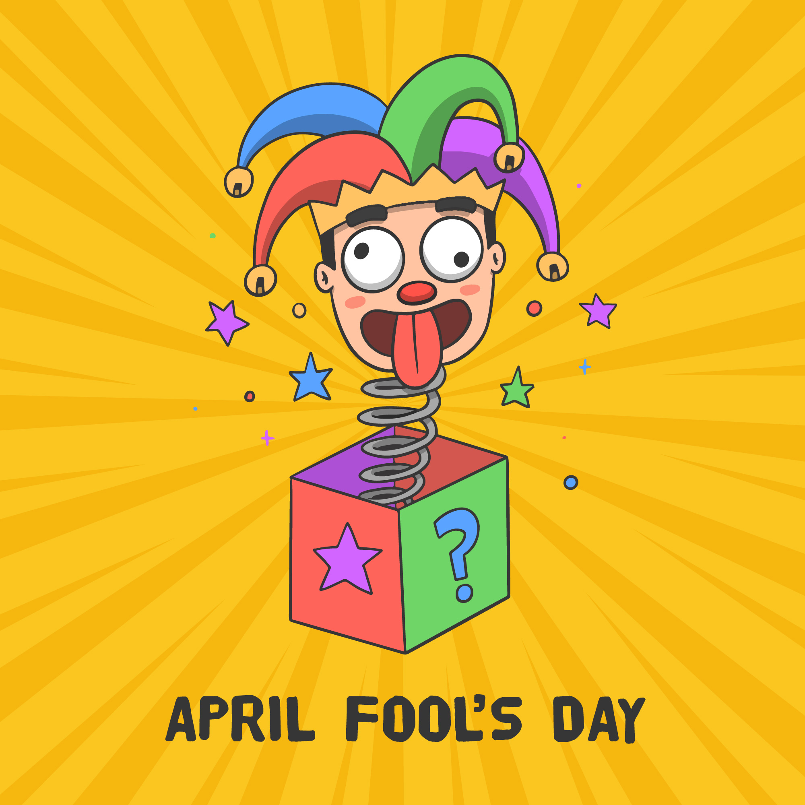

<!DOCTYPE html>
<html lang="en">
<head>
    <meta charset="UTF-8">
    <meta name="viewport" content="width=device-width, initial-scale=1.0">
    <title>April Fool!</title>
    
</head>
<body>
    <h1>🎉 APRIL FOOLS! 🎉</h1>
    
You’ve been pranked! 😂 Now it's your turn to prank someone else!

    <!-- Prank Image -->
    

    <!-- Hidden Audio -->
    <audio id="prankAudio">
        <source src="laugh-like-crazy-257881.mp3" type="audio/mpeg">
    </audio>

    
</body>
</html>
